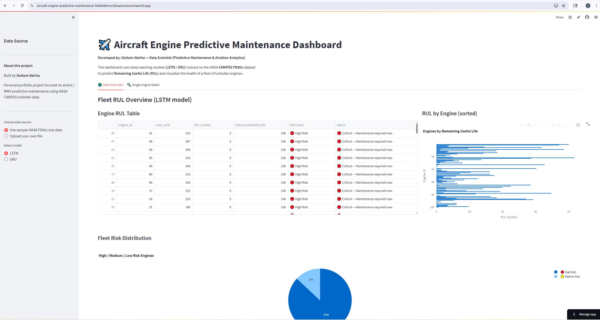

# ✈️ Aircraft Engine Predictive Maintenance

Predicting Remaining Useful Life (RUL) of jet engines using NASA’s C-MAPSS turbofan dataset and deep learning models (LSTM and GRU).

This project demonstrates how machine learning can be used to predict aircraft engine degradation and estimate the remaining useful life of engines to support predictive maintenance and prevent unexpected failures.

### Key Capabilities

• Remaining Useful Life (RUL) prediction using LSTM and GRU  
• Aircraft engine degradation monitoring  
• Fleet-level failure risk ranking  
• Sensor anomaly detection  
• Real-time dashboard using Streamlit

## Dashboard Preview




---

## Project Overview

Aircraft engine failures can lead to costly downtime, safety risks, and Aircraft-on-Ground (AOG) events.

This project builds an end-to-end predictive maintenance system that:

• Processes multivariate engine sensor data  
• Predicts Remaining Useful Life (RUL)  
• Detects degradation patterns  
• Provides an interactive monitoring dashboard  

The system allows maintenance teams to identify high-risk engines early and optimize maintenance scheduling.

---

## Dataset

NASA **C-MAPSS Turbofan Engine Degradation Dataset**

Dataset source:

https://ti.arc.nasa.gov/tech/dash/groups/pcoe/prognostic-data-repository/

Dataset characteristics:

• Multiple engines run until failure  
• 21 sensor measurements  
• 3 operational settings  
• Time-series degradation data  

This project uses the **FD001 subset** which contains:

• Single operating condition  
• Single failure mode  

---

## Machine Learning Pipeline

### Data Preprocessing

• Sensor normalization using MinMaxScaler  
• Removal of non-informative sensors  
• Creation of sliding window sequences  

### Feature Engineering

• Sequence length: **30 cycles**  
• RUL labels generated for each cycle  
• RUL capped to stabilize model training  

---

## Deep Learning Models

Two sequence models were trained for RUL regression.

### LSTM (Long Short-Term Memory)

Captures long-term temporal dependencies in engine sensor data.

### GRU (Gated Recurrent Unit)

Simplified recurrent architecture with fewer parameters.

---

## Model Performance

| Model | MAE | RMSE |
|------|------|------|
| LSTM | 9.07 | 12.77 |
| GRU | 9.38 | 12.96 |

The LSTM model achieved slightly better predictive accuracy.

---

## Streamlit Dashboard

The project includes an interactive **Streamlit dashboard** for real-time engine monitoring.

Dashboard features:

• Upload engine cycle data  
• Predict Remaining Useful Life (RUL)  
• Visualize engine degradation trends  
• Detect sensor anomalies using Z-score  
• Generate PDF engine health reports  
• Rank engines by failure risk  

---

## Business Impact

Predictive maintenance helps airlines:

• Prevent unexpected engine failures  
• Reduce Aircraft-on-Ground (AOG) events  
• Optimize maintenance scheduling  
• Reduce maintenance costs  
• Improve fleet reliability and safety  

In aviation systems, **false negatives (missed failures)** are significantly more costly than false positives because they may lead to catastrophic engine failure.

---
## Project Structure

```
aircraft-engine-predictive-maintenance
│
├── app.py
├── requirements.txt
├── README.md
│
├── models
│   ├── lstm_fd001_best.h5
│   └── gru_fd001_best.h5
│
├── data
│   └── raw
│
└── notebooks
    ├── 01_EDA.ipynb
    ├── 02_Feature_Engineering.ipynb
    └── 03_Model_Training.ipynb
```

## Run Locally

Install dependencies:

```
pip install -r requirements.txt
```

Run the Streamlit dashboard:

```
streamlit run app.py
```

## Live Application

Streamlit demo:

https://aircraft-engine-predictive-maintenance-fia9afdhmvn34uaicwneul.streamlit.app/

---
## Technologies Used

• Python  
• TensorFlow / Keras  
• Scikit-learn  
• Pandas & NumPy  
• Streamlit  
• Matplotlib / Seaborn  

## Author

**Goitom Abirha**  
Data Scientist – Predictive Maintenance & Machine Learning

GitHub  
https://github.com/goitom-abirha

LinkedIn  
https://www.linkedin.com/in/goitom-abirha-089428397


